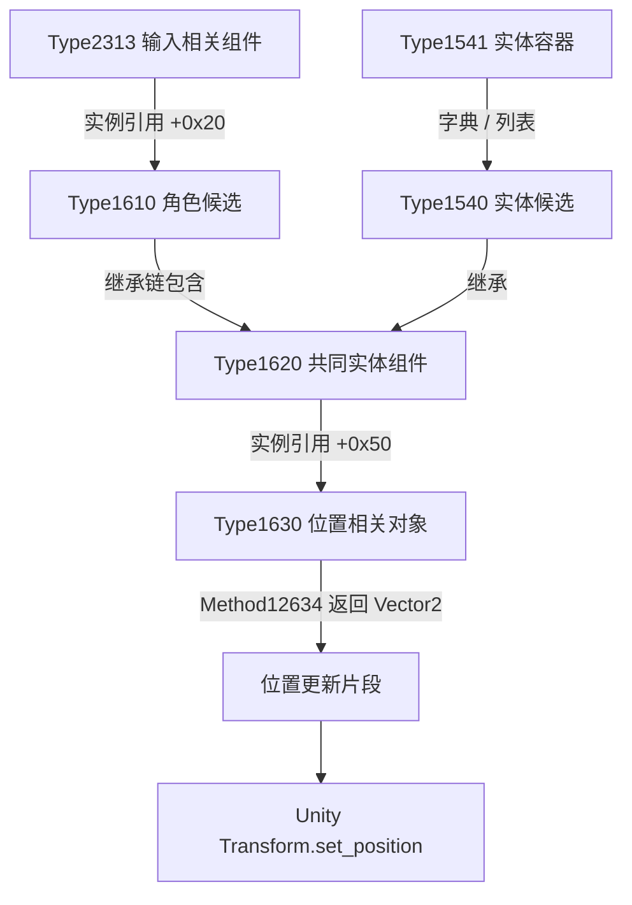

# 进一步分析：位置更新链路

本报告分析安装文件中的机器码，没有调用游戏函数、修改客户端或取得实时坐标。类型和方法编号对应同目录 `types.json` 和 `method-map.json`；所有 RVA 都是相对 GameAssembly.dll 的静态地址。

## 已确认的结构和指令

游戏程序集有 23,396 个方法定义，方法表中 23,005 项具有非空代码指针。对九个重点类型导出 898 个方法的有界反汇编片段。非空不等于唯一函数，不同方法可以共享实现。

| 证据 | RVA / 位置 | 可确认的含义 |
| --- | --- | --- |
| Type2313 / Method17239 | `0x016E4560` | `mov rax,[rcx+0x20]; ret`，返回 Type1610 引用，与元数据字段类型一致 |
| Type1620 / Method12558 | `0x0120C500` | 读取实例 `+0x64` 的8字节，返回类型为 Vector2 |
| Type1620 / Method12559 | `0x0120C510` | 读取实例 `+0x6C` 的8字节，返回类型为 Vector2 |
| Type1620 / Method12546 | `0x0120C410` | 读取实例 `+0x50`，返回 Type1630 关联对象 |
| Type1620 / Method12565 | `0x0120C8A0` | 方法包含从 `+0x50` 取得关联对象、调用其 Method12634，并将返回的两部分传给 Transform.set_position 的数据流片段 |
| Type1630 / Method12634 | `0x01217390` | 返回 Vector2；包含读取 `+0xF8/+0xFC` 的路径，以及读取两组 double 值作插值的路径 |
| Type1630 / Method12632 | `0x01217360` | 把传入向量写到 `+0xF8`，同时更新 `+0xF4` 的布尔字段 |

Method12565 中的关键证据位置：

- `0x0120CBD4` 读取实体的 `+0x50` 引用。
- `0x0120CBFB` 调用 Type1630 / Method12634。
- `0x0120CC00` 与 `0x0120CC08` 将返回值拆成两个浮点分量。
- `0x0120CD23` 与 `0x0120CD2F` 将分量放入传给引擎的位置向量，Z 分量设为0。
- `0x0120CD48` 调用已通过 UnityEngine.CoreModule 方法表识别的 `UnityEngine.Transform.set_position`。

因此，Type1630 / Method12634 是比“任意 Vector2 字段”更有力的位置相关候选。该方法中出现的间接跳转和运行时全局值尚未完整还原，不能声称已经恢复所有分支语义。

## 为什么不能直接把 +0x64 当作坐标

虽然 Type1620 的 +0x64/+0x6C 确实是两个向量字段，现阶段没有证据表明它们就是当前世界坐标。已经发现的位置更新片段使用的是关联对象 Type1630 的返回值。

Type1630 还包含两份 Type1627 值类型数据（实例内 +0x98 和 +0xB8）。Type1627 有四个 Double 字段。Method12634 读取其中的 +0x98/+0xA0 与 +0xB8/+0xC0，并包含与 Time.get_unscaledTime 有关的插值计算。这提示显示位置可能经过插值，直接读取某一组数值未必等于屏幕上显示的位置。

## 当前候选关系

这是类型引用/调用关系图，不是已定位的运行时指针链。Type1610 是否为“小棒槌啊”、Type1540 是否为怪物，均未动态确认。

## 当前角色与地图验证

已按用户提供的“小棒槌啊”“射手村”“金银岛”和英文 Henesys，搜索 metadata 与 DLL 的 UTF-8/UTF-16LE 明文，均未命中。这不说明用户提供的信息有误：角色名属于运行时内容，地图显示文字也可能来自资源包。

PID12704 的 VirtualQueryEx 可以查询区域信息，但对已提交、可读的私有内存进行读取，连续32次 ReadProcessMemory 返回错误5，成功读取字节数为0，搜索因此提前结束。不能把该结果当作“进程内不存在名字”。详见 `player-name-probe.json`。

脚本与游戏均已确认处于管理员权限；此前建议管理员重试不适用于这次已测的权限状态。

## 尚未完成

- 没有活跃的输入组件、角色或实体容器实例地址。
- 没有玩家名与候选对象的对应关系。
- 没有射手村地图 ID、平台/梯子数据、实时怪物坐标。
- 方法片段是有界线性反汇编，较长方法标记 truncated，不是完整反编译或可直接运行的游戏代码。

已有结构足够指导后续对象验证，但访问限制仍独立存在；这些静态偏移不能用于宣称脚本已经能寻怪或绘制真实位置。
