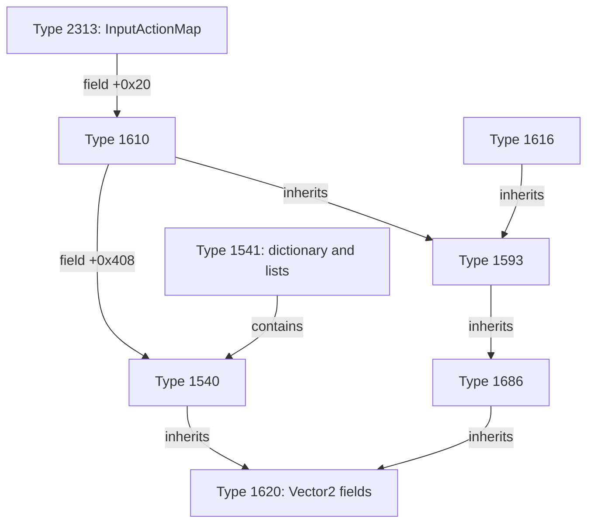

# 怀旧版 IL2CPP 静态分析结果

已从本地 metadata v39 和 GameAssembly.dll 恢复类型定义、继承关系、字段类型、泛型容器参数及编译时字段偏移。没有读取运行中对象，也没有确认玩家/怪物真实坐标。

共 16,887 个类型、85,068 个字段、139,188 个方法，分属 100 个程序集。
游戏主程序集含 2576 个类型，其中 2553 个类型名含长十六进制混淆串；发现 112 个含 Vector2/Vector3/Vector2Int 实例字段的类型。

## 重点线索

下表 Type 编号是该文件的全局类型索引。用途是根据字段与继承关系作出的推测，不是恢复出的原始类名。

| 类型 | 已确认的结构 | 用途推测 / 尚缺验证 |
| --- | --- | --- |
| Type 1620 | 继承 MonoBehaviour；ContactFilter2D；两个 Vector2 字段在 +0x64、+0x6C | 共同场景实体组件候选；两个向量可能是坐标、速度或缓存，未确认 |
| Type 1540 | 继承 1620；拥有 Vector2 +0xF8 | 某类可交互实体候选，可能与怪物有关 |
| Type 1541 | Dictionary<Int32, Type1540> +0x10；三个 List<Type1540> +0x18/+0x20/+0x28 | Type1540 实体容器已确认；是否为怪物池未知 |
| Type 1686 → 1593 | 1686 继承 1620；1593 继承 1686 | 多层实体继承链，可能与角色表现/移动有关 |
| Type 1610 | 继承 1593；含 Type1540 引用 +0x408、Vector2 +0x410 | 本地角色候选；与输入组件有关联，但尚未确认 |
| Type 1616 | 同样继承 1593；新增两个 Vector2 +0x3A8/+0x3B0 | 与1610同系的另一实体类型；不能确定就是其他玩家 |
| Type 2313 | Type1610 引用 +0x20，InputActionMap +0x28，EventSystem +0x30 | 输入相关组件；支持1610与用户输入关联的推测 |

## 证据与地址含义

- 元数据各表尺寸、成员范围、字段/方法/类型 token、方法所属类型、程序集范围通过校验。
- 原生注册表只找到一个符合两处类型计数及指针范围校验的候选；所有类型的 byval 类型名与元数据一致，全部字段类型均成功解析。
- +0x… 来自原生字段偏移表。实例字段、静态字段、字面常量分别标记；静态字段偏移不能加到实例地址，泛型/值类型的布局也需要额外注意。
- JSON 的 metadata_offset 是元数据文件偏移；registration.file_offset 是 DLL 文件偏移；*_va 是 PE 首选加载地址下的静态虚拟地址，均不是已测出的运行时地址。
- 本表给出的 Vector2 偏移只确认“那里有一个向量字段”，不能视作已确认的玩家或怪物坐标。
- 尚未识别地图 ID、平台、梯子数据结构；不能生成真实地图形状。

## 后续需要解决

1. 通过相关方法的静态分析或可访问的运行时数据，验证重点候选的业务含义，区分位置、速度、目标点和界面坐标。
2. 定位活跃实例来源，不能仅凭类定义或字段偏移拼出有效指针链。
3. 解决当前游戏进程模块查询的拒绝访问后，再做移动、换图、怪物生成/消失等动态对照。当前这些步骤尚未完成。

## 文件

- `types.json`：全部类型、字段、方法、泛型类型名和原生偏移。
- `reviewed-structures.json`：上表的八个重点类型，保留完整混淆名称。
- `vector-candidates.json`：所有含向量实例字段的游戏类型，包含界面等误报。
- `literal-clues.json`：关键词命中的字符串常量，不包含它们与具体方法的交叉引用。
- `header.json` / `statistics.json`：版本、文件指纹、表布局和统计。

## 输入指纹

- global-metadata.dat SHA256: `91a1e8ee417864de6163517dd2b2ce001ea39c127fc840060e59d81610d1985d`
- GameAssembly.dll SHA256: `ff7cb8d1d89e2145b3e626d431cd27521570b1ae3ff68dfbb04f99568ded81de`

## 格式参考

[Cpp2IL 元数据表头](https://github.com/SamboyCoding/Cpp2IL/blob/development/LibCpp2IL/Metadata/Il2CppGlobalMetadataHeader.cs)、[变长索引](https://github.com/SamboyCoding/Cpp2IL/blob/development/LibCpp2IL/Metadata/Il2CppVariableWidthIndex.cs)、[原生类型结构](https://github.com/SamboyCoding/Cpp2IL/blob/development/LibCpp2IL/BinaryStructures/Il2CppType.cs)。参考源码快照保存在 reference 目录。
